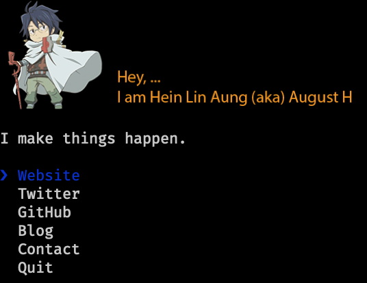

> The [Hein Lin Aung](https://heinlinaung.github.com) CLI




## Usage

First, install Node.js, then ...

```
$ npx heinlinaung
```


## Built with

- Ref - https://github.com/sindresorhus/sindresorhus
- [ink](https://github.com/vadimdemedes/ink) - React for interactive command-line apps
- [terminal-image](https://github.com/sindresorhus/terminal-image) - Display images in the terminal